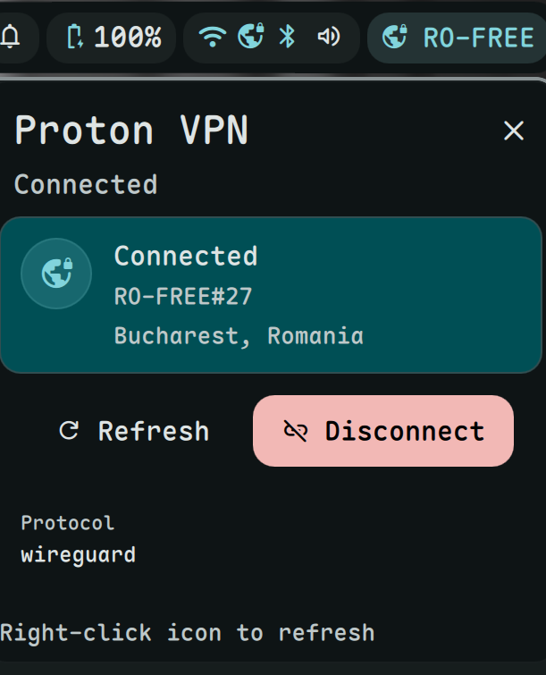

# Proton VPN Plugin

A Proton VPN connection status and control widget for [Dank Material Shell](https://github.com/AvengeMedia/DankMaterialShell).



## Installation

```bash
mkdir -p ~/.config/DankMaterialShell/plugins
git clone https://github.com/hthienloc/dms-proton-vpn ~/.config/DankMaterialShell/plugins/protonVpn
```

Then in DMS: **Settings (Meta+,)** → **Plugins** → **Scan for Plugins** → Enable **Proton VPN**.

To update:
```bash
git -C ~/.config/DankMaterialShell/plugins/protonVpn pull
```

## Requirements

**Proton VPN CLI** must be installed and configured:

```bash
# Install proton-vpn-cli
pip install proton-vpn-cli

# Initialize (follow prompts)
protonvpn configure
```

### Connect/Disconnect Permission

The Proton VPN CLI requires sudo to connect/disconnect. Add to sudoers:

```bash
sudo visudo
# Add this line:
%wheel ALL=(ALL) NOPASSWD: /usr/bin/protonvpn
```

Or copy the command from the plugin popout.

## Features

- **Status Display**: Shows current server, location, and protocol.
- **One-Click Connect/Disconnect**: Toggle from the widget.
- **Visual Feedback**:
    - Accent color when connected.
    - Warning color when disconnecting.
    - Rotating icon during connection process.
- **Auto-Refresh**: Updates status every 30 seconds.
- **Interactive Controls**:
    - **Left click**: Open detailed popout.
    - **Right click**: Refresh status.

## Structure

```
dms-proton-vpn/
├── ProtonVPNWidget.qml    # Main logic and UI
├── ProtonVPNSettings.qml  # Settings interface
├── plugin.json            # Plugin manifest
├── LICENSE
└── README.md
```

## License

GPLv3 - See [LICENSE](LICENSE)